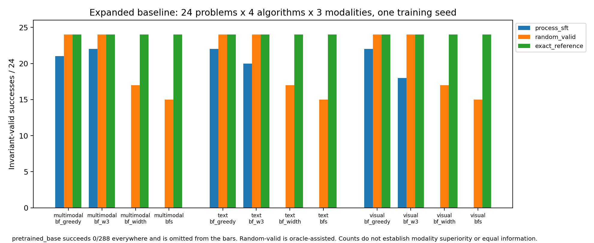
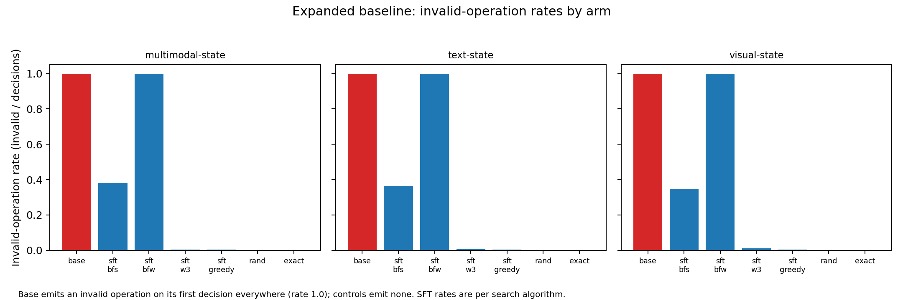
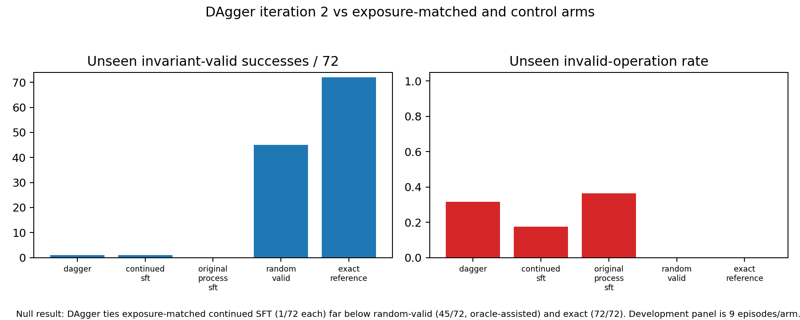
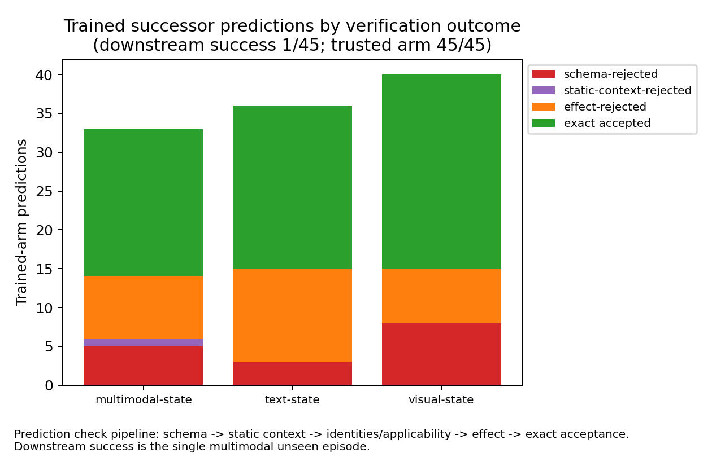
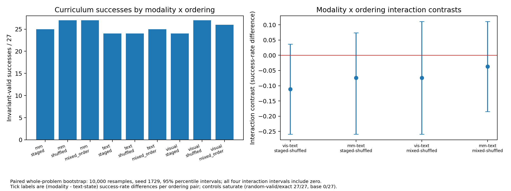
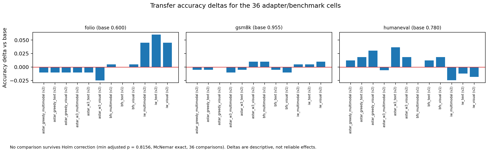
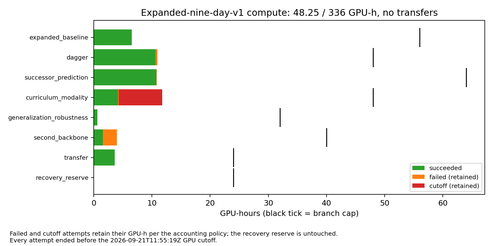

# Expanded study synthesis — #120

Reproduce with `source ~/cd_vlaplan`, then `CUDA_VISIBLE_DEVICES='' python scripts/synthesize_expanded_study.py`. Add `--check` for read-only regeneration and byte-comparison of the JSON, CSVs, report and claims against the published copies. No model calls occur; the synthesis is CPU-only and never touches CUDA.

## 1. Program scope and branch reconciliation

Program `expanded-nine-day-v1` ran on 2 x NVIDIA A100 80GB under a 336 GPU-hour cap with an absolute GPU cutoff of 2026-09-21T11:55:19Z and 48 CPU writing hours reserved. Seven branches were admitted; five executed to completion and two stopped terminal VALID_STOP at frozen cost-admission gates. Reconciliation (`branch-reconciliation.csv`, `budget.csv`):

| Branch | Tickets | Terminal state | Coverage declared | Coverage actual | GPU-h / cap | Audit verdict |
| --- | --- | --- | --- | --- | ---: | --- |
| expanded_baseline | #116 #117 #118 | complete | 1152 logical bindings (576 model episodes) | 1152/1152 episodes; independent replay PASS | 6.5289 / 56 | PASS (goal3 audit) |
| dagger | #78-#84 | complete | 405 episodes + 81 paired whole-problem rows | 405/405 episodes; missing 0 | 10.9092 / 48 | PASS (goal6 audit) |
| successor_prediction | #85-#89 #99 | complete | 90 episodes (15 modality x panel cells) | 90/90 episodes; missing 0 | 10.8511 / 64 | PASS (goal9 audit) |
| curriculum_modality | #119 | complete | 243 model episodes + 324 comparator bindings | 243/243 model + 324/324 comparator; missing none | 11.7786 / 48 | PASS (goal10 audit) |
| transfer | #104-#107 | complete | 12 v1 cells + 27 v2 cells; 36 paired comparisons | 39/39 cells; missing [] both protocols | 3.5993 / 24 | PASS (goal13 audit) |
| second_backbone | #101 #102 #103 | VALID_STOP (L2) | no model outcomes (cost admission) | probe + CPU qualification only | 3.9577 / 40 | VALID_STOP (admission L2) |
| generalization_robustness | #96 #98 | VALID_STOP (L4) | 120 generated variants | 93 eligible / 27 missing; 0 replacements | 0.6273 / 32 | VALID_STOP (admission L4) |
| recovery_reserve | - | untouched | - | - | 0.0000 / 24 | - |

Open issues #96 and #98 (generalization/robustness) and #102/#103 (second backbone) are explicitly incomplete: both branches published terminal VALID_STOP evidence with admission arithmetic instead of model outcomes. Five branches' goal audits (goal2-goal10, goal13) are `complete` and goal-1 readiness is `PASS` (verification.json: GOAL-AUDITS).

## 2. Matched modalities: expanded baseline

The expanded panel keeps modality matched: 24 whole problems x 4 algorithms x 3 modalities x 4 arms = 1,152 logical bindings (576 model episodes). Every number below was recomputed from the 1,152 gzipped episode reports and matches `baseline-evaluation.json` byte-for-value (verification.json: BASELINE-RECOMPUTE); the independent replay is PASS. Full per-cell rows are in `baseline-summary.csv`, per-task paired differences in `baseline-paired.csv`.

| Modality | Algorithm | pretrained_base | process_sft | random_valid | exact_reference |
| --- | --- | --- | --- | --- | --- |
| multimodal-state | best_first_add_greedy | 0/24 (24/24 inv/dec, 0 exp) | 21/24 (3/617 inv/dec, 179 exp) | 24/24 (0/673 inv/dec, 198 exp) | 24/24 (0/673 inv/dec, 198 exp) |
| multimodal-state | best_first_add_w3 | 0/24 (24/24 inv/dec, 0 exp) | 22/24 (2/666 inv/dec, 196 exp) | 24/24 (0/694 inv/dec, 206 exp) | 24/24 (0/694 inv/dec, 206 exp) |
| multimodal-state | best_first_width | 0/24 (24/24 inv/dec, 0 exp) | 0/24 (24/24 inv/dec, 0 exp) | 17/24 (0/922 inv/dec, 537 exp) | 24/24 (0/974 inv/dec, 568 exp) |
| multimodal-state | bfs | 0/24 (24/24 inv/dec, 0 exp) | 0/24 (24/63 inv/dec, 15 exp) | 15/24 (0/1905 inv/dec, 1173 exp) | 24/24 (0/1969 inv/dec, 1210 exp) |
| text-state | best_first_add_greedy | 0/24 (24/24 inv/dec, 0 exp) | 22/24 (2/614 inv/dec, 179 exp) | 24/24 (0/673 inv/dec, 198 exp) | 24/24 (0/673 inv/dec, 198 exp) |
| text-state | best_first_add_w3 | 0/24 (24/24 inv/dec, 0 exp) | 20/24 (4/609 inv/dec, 179 exp) | 24/24 (0/694 inv/dec, 206 exp) | 24/24 (0/694 inv/dec, 206 exp) |
| text-state | best_first_width | 0/24 (24/24 inv/dec, 0 exp) | 0/24 (24/24 inv/dec, 0 exp) | 17/24 (0/922 inv/dec, 537 exp) | 24/24 (0/974 inv/dec, 568 exp) |
| text-state | bfs | 0/24 (24/24 inv/dec, 0 exp) | 0/24 (24/66 inv/dec, 15 exp) | 15/24 (0/1905 inv/dec, 1173 exp) | 24/24 (0/1969 inv/dec, 1210 exp) |
| visual-state | best_first_add_greedy | 0/24 (24/24 inv/dec, 0 exp) | 22/24 (2/643 inv/dec, 189 exp) | 24/24 (0/673 inv/dec, 198 exp) | 24/24 (0/673 inv/dec, 198 exp) |
| visual-state | best_first_add_w3 | 0/24 (24/24 inv/dec, 0 exp) | 18/24 (6/499 inv/dec, 143 exp) | 24/24 (0/694 inv/dec, 206 exp) | 24/24 (0/694 inv/dec, 206 exp) |
| visual-state | best_first_width | 0/24 (24/24 inv/dec, 0 exp) | 0/24 (24/24 inv/dec, 0 exp) | 17/24 (0/922 inv/dec, 537 exp) | 24/24 (0/974 inv/dec, 568 exp) |
| visual-state | bfs | 0/24 (24/24 inv/dec, 0 exp) | 0/24 (24/69 inv/dec, 17 exp) | 15/24 (0/1905 inv/dec, 1173 exp) | 24/24 (0/1969 inv/dec, 1210 exp) |

Paired whole-problem contrasts (10,000 paired resamples of the 24 problems, seed 1729, 95% percentile intervals; per-modality rows in `baseline-contrasts.csv`):

| Contrast | bfs | best_first_width | best_first_add_w3 | best_first_add_greedy |
| --- | ---: | ---: | ---: | ---: |
| process_sft - pretrained_base | +0.000 (wins 0, losses 0, ties 72) | +0.000 (wins 0, losses 0, ties 72) | +0.833 (wins 60, losses 0, ties 12) | +0.903 (wins 65, losses 0, ties 7) |
| process_sft - random_valid | -0.625 (wins 0, losses 45, ties 27) | -0.708 (wins 0, losses 51, ties 21) | -0.167 (wins 0, losses 12, ties 60) | -0.097 (wins 0, losses 7, ties 65) |
| process_sft - exact_reference | -1.000 (wins 0, losses 72, ties 0) | -1.000 (wins 0, losses 72, ties 0) | -0.167 (wins 0, losses 12, ties 60) | -0.097 (wins 0, losses 7, ties 65) |
| random_valid - exact_reference | -0.375 (wins 0, losses 27, ties 45) | -0.292 (wins 0, losses 21, ties 51) | +0.000 (wins 0, losses 0, ties 72) | +0.000 (wins 0, losses 0, ties 72) |

SFT success is concentrated in the additive best-first family; with BFS or best-first-width bookkeeping SFT fails 0/24 in every modality, always terminating on an invalid operation. Bootstrap intervals here are tiny-subgroup descriptive bounds over 24 problems and one training seed — they do not establish modality superiority.

**Historical v5, kept separate.** The v5 study (`docs/experiments/matched-modalities/`) is a 3-problem panel on its own ledger: 3 problems x 4 algorithms x 3 modalities = 144 bindings, 72 model episodes. Its summaries: SFT 5/12 text, 6/12 visual, 6/12 multimodal; base 0/12; random-valid 10/12; exact 12/12. It is not pooled with the 24-problem expanded panel above. Historical #67 (`data/best_first_paired_phase_v3/issue67-terminal/result.json`) reports 60/60 saturated successes under staged, shuffled and mixed order (five rollout seeds per adapter, complete control saturation, `pooled: false` in the curriculum runtime analysis); its +/-0.05 practical-equivalence finding cannot separate orderings and is reported separately under its unmatched historical schedule.

## 3. DAgger (#78-#84)

Two DAgger iterations against an exposure-matched continued-SFT control on BFS, evaluated on 3 development + 24 unseen modality-task pairs with 5 arms (`dagger-summary.csv`):

| Arm | Dev successes/9 | Unseen successes/72 | Unseen invalid rate |
| --- | ---: | ---: | ---: |
| dagger_iteration_2 | 3/9 | 1/72 | 0.316 |
| continued_sft_iteration_2 | 2/9 | 1/72 | 0.175 |
| original_process_sft | 1/9 | 0/72 | 0.364 |
| random_valid | 6/9 | 45/72 | 0.000 |
| exact_reference | 9/9 | 72/72 | 0.000 |

Null result, stated plainly: DAgger did not work here. On the unseen panel DAgger and continued SFT each achieve 1/72 invariant-valid successes (paired: one DAgger win, one loss, 70 ties); both remain far below the oracle-assisted random-valid control (45/72) and exact-reference (72/72). The original SFT gets 0/72. Final cumulative unique training corrections are text 201, visual 203, multimodal 181, accumulated over 12 training cells x 512 records x 16 optimizer updates per cell-iteration.

## 4. Successor prediction (#85-#89/#99)

Collection verification of the untrained exact-successor on the frozen 1,536-interaction release (`successor-data.json`):

| Modality | Records | Accepted | Effect-rejected | Schema-rejected | State-identity-rejected |
| --- | ---: | ---: | ---: | ---: | ---: |
| multimodal-state | 512 | 24 | 12 | 458 | 18 |
| text-state | 512 | 43 | 31 | 404 | 34 |
| visual-state | 512 | 52 | 25 | 412 | 23 |

Trained-arm per-cell check outcomes (`successor-summary.csv`), pooled over panels per modality:

| Modality | Predictions | Exact accepted | Schema valid | Effect valid | Downstream success |
| --- | ---: | ---: | ---: | ---: | ---: |
| multimodal-state | 33 | 19 | 28 | 20 | 1/15 |
| text-state | 36 | 21 | 33 | 21 | 0/15 |
| visual-state | 40 | 25 | 32 | 25 | 0/15 |

Downstream, the trained model-generated successor arm succeeds on 1/45 episodes (the single multimodal unseen success) while the trusted-successor arm succeeds on 45/45 with zero trusted-state substitutions; raw predictions retained 109. Full 24-task unseen coverage is missing by design: the frozen outcome-blind admission accepted the 12-task fallback panel after Goal 7 projected 147.66 GPU-h for the full panel, infeasible within the 64 GPU-h branch cap.

## 5. Curriculum ordering by modality (#119)

Nine cells (3 modalities x staged/shuffled/mixed order under best_first_add_greedy) trained fresh from the same base with identical record sets, plus four comparator arms (`curriculum-summary.csv`). Successes out of 27 unseen whole problems:

| Modality | staged | shuffled | mixed_order | base | sequential SFT | random_valid | exact |
| --- | ---: | ---: | ---: | ---: | ---: | ---: | ---: |
| multimodal-state | 25/27 | 27/27 | 27/27 | 0/27 | 24/27 | 27/27 | 27/27 |
| text-state | 24/27 | 24/27 | 25/27 | 0/27 | 24/27 | 27/27 | 27/27 |
| visual-state | 24/27 | 27/27 | 26/27 | 0/27 | 25/27 | 27/27 | 27/27 |

Modality x ordering interaction contrasts (paired whole-problem bootstrap, 10,000 resamples, seed 1729, 95% percentile intervals):

| Contrast | Point | 95% CI |
| --- | ---: | --- |
| (visual-state:staged-shuffled)-(text-state:staged-shuffled) | -0.111 | [-0.259, +0.037] |
| (multimodal-state:staged-shuffled)-(text-state:staged-shuffled) | -0.074 | [-0.259, +0.074] |
| (visual-state:mixed_order-shuffled)-(text-state:mixed_order-shuffled) | -0.074 | [-0.259, +0.111] |
| (multimodal-state:mixed_order-shuffled)-(text-state:mixed_order-shuffled) | -0.037 | [-0.185, +0.111] |

All four interaction intervals include zero: there is no detectable curriculum-ordering by modality interaction. Saturation caveat: random-valid and exact controls saturate at 27/27 in every modality and the base at 0/27, so ceiling/floor effects bound observable differences.

## 6. Generalization/robustness and second backbone: VALID_STOP

**Generalization/robustness (#96/#98), admission L4 VALID_STOP.** The frozen suite generated 120 variants (24 scale-up, 24 shifted-init, 72 perturbations). Qualification retained 93 eligible variants with 27 missing (24 `exact_reference_failed:bfs:expansion_budget_exhausted`, 2 `initial_goal`, 1 `structural whole-instance overlap`) and zero replacements. Every scope level fails the Gate-2 admission: even L3 (34 tasks) requires 1704.89 GPU-h against a 31.37 GPU-h remainder. No derived-task model evaluation was launched. One robustness finding exists without any model call: P3 name-compression is information-lossy exactly where names carry semantics — text 24/24 lossy, visual 0/24 lossy, multimodal 18/24 lossy.

**Second backbone (#101-#103), admission L2 VALID_STOP.** The probe qualifies OpenGVLab/InternVL3_5-8B-HF @741a7d03020411e666c6109218ab71e08151ef86 (visual_sdpa attention, byte-identical batched outputs, repeated-batch determinism, adapter isolation, token-limit guards; 1,536 records / 24 tasks / 5,907 decisions measured CPU-only). The cost admission then stops the branch:

| Level | Episodes | Train GPU-h | Eval GPU-h | Required incl. spent | Fits 36.04 remainder |
| --- | ---: | ---: | ---: | ---: | --- |
| L0 | 144 | 2.70 | 200.87 | 258.42 | False |
| L1 | 72 | 2.70 | 32.64 | 48.14 | False |

Neither branch mutated the ledger; both remain open as incomplete evidence publications.

## 7. Transfer to external benchmarks (#104-#107)

Zero-shot transfer of all 12 verified planning adapters plus the base to frozen FOLIO (200), GSM8K (200) and HumanEval (164) subsets (`transfer-accuracy.csv`):

| Benchmark | base | bfs t/v/m | iw t/v/m | astar_w3 t/v/m | astar_greedy t/v/m |
| --- | ---: | --- | --- | --- | --- |
| folio | 0.600 | 0.600/0.605/0.605 | 0.660/0.645/0.645 | 0.590/0.575/0.590 | 0.590/0.590/0.590 |
| gsm8k | 0.955 | 0.950/0.945/0.965 | 0.960/0.965/0.960 | 0.950/0.965/0.945 | 0.950/0.955/0.950 |
| humaneval | 0.780 | 0.793/0.799/0.780 | 0.768/0.762/0.756 | 0.817/0.799/0.774 | 0.799/0.811/0.793 |

Paired verdict (`transfer-paired.csv`): 36 McNemar exact comparisons against the per-example base predictions; none survives Holm correction (minimum adjusted p = 0.8156; smallest raw p = 0.0227 for folio/iw_text at +12 examples). Leakage screening over the frozen 8-gram window finds 7/564 benchmark items sharing only trivial numeric 8-grams with the planning corpus, zero content overlap. Timing disclosure: transfer-v2 was authorized and executed after transfer-v1 completed, as a user-authorized exhaustive extension over byte-identical frozen subsets, prompts and decoding.

## 8. Compute accounting

Per-branch ledger reconciliation (sums recomputed from all 116 recorded attempts; failed and cutoff attempts retain their hours per the accounting policy):

| Branch | Attempts (s/f/c) | Succeeded GPU-h | Failed GPU-h | Cutoff GPU-h | Total GPU-h | Cap |
| --- | --- | ---: | ---: | ---: | ---: | ---: |
| expanded_baseline | 20/2/0 | 6.5289 | 0.0000 | 0.0000 | 6.5289 | 56 |
| dagger | 21/7/0 | 10.5928 | 0.3164 | 0.0000 | 10.9092 | 48 |
| successor_prediction | 21/10/0 | 10.7636 | 0.0876 | 0.0000 | 10.8511 | 64 |
| curriculum_modality | 6/4/3 | 4.1671 | 0.1121 | 7.4994 | 11.7786 | 48 |
| generalization_robustness | 1/0/0 | 0.6273 | 0.0000 | 0.0000 | 0.6273 | 32 |
| second_backbone | 3/4/0 | 1.5603 | 2.3973 | 0.0000 | 3.9577 | 40 |
| transfer | 12/2/0 | 3.5993 | 0.0000 | 0.0000 | 3.5993 | 24 |
| recovery_reserve | 0/0/0 | 0.0000 | 0.0000 | 0.0000 | 0.0000 | 24 |
| **Total** | **84/29/3** | **37.8393** | **2.9134** | **7.4994** | **48.2521 / 336** | 336 |

The program spent 48.25/336 GPU-h (14.4% of cap). No transfers were requested or made between branches; the recovery reserve (24 GPU-h) is untouched; every attempt ended before the 2026-09-21T11:55:19Z GPU cutoff. Ledger-vs-branch cumulative totals agree within 0.01 GPU-h everywhere (verification.json: LEDGER, LEDGER-VS-BRANCH; the transfer docs' 3.5993 rounds the ledger's 3.59932 and the second-backbone admission conservatively double-counts the 0.63 GPU-h probe window in its remainder arithmetic).

## 9. Claim inventory and boundaries

- **coverage** [supported]: Every executed branch reconciles with zero missing evidence: 1,152/1,152 baseline episodes independently replayed, 405/405 DAgger episodes, 90/90 successor episodes, 243/243 curriculum model episodes with 324/324 comparator bindings, and 39/39 transfer cells (12 v1 + 27 v2). Evidence: `verification.json: BASELINE-RECOMPUTE, DAGGER, SUCCESSOR, CURRICULUM, TRANSFER; baseline-independent-replay.json`.
- **baseline-validity** [supported]: The pretrained base never emits a schema/search-valid operation (0/288 successes; every episode terminates on an invalid operation). Process-SFT succeeds on 125/288 with 163 invalid operations, and SFT driving BFS or best-first-width search fails 0/24 in every modality. Evidence: `baseline-summary.csv: arm=pretrained_base/process_sft; baseline-paired.csv; verification.json: BASELINE-RECOMPUTE`.
- **baseline-controls** [boundary]: Random-valid, an oracle-assisted programmatic valid-operation control, reaches 240/288 (bfs 15/24, best_first_width 17/24, w3 24/24, greedy 24/24, identical across modalities); exact-reference reaches 288/288 with per-modality decisions of bfs 1969, bfw 974, w3 694, greedy 673. These are bounds and references, not model abilities. Evidence: `baseline-summary.csv: arm=random_valid/exact_reference; baseline-contrasts.csv: random_valid_minus_exact_reference`.
- **dagger-null** [negative]: DAgger is a null result on the 72 unseen modality-task pairs: 1 invariant-valid success, identical to exposure-matched continued SFT (1/72) and far below random-valid (45/72); one paired win, one paired loss and 70 ties vs continued SFT. Final cumulative unique training corrections: text 201, visual 203, multimodal 181 over 12 training cells x 512 records x 16 updates. Evidence: `dagger-summary.csv; dagger-comparison.json: paired_whole_problem, final_cumulative_unique_training_corrections, training_exposure`.
- **successor-verification** [negative]: The untrained exact-successor verification accepts 119/1536 collection predictions (text 43, visual 52, multimodal 24). The trained successor is exact on 65/109 predictions (93 schema-valid, 66 effect-valid) and yields 1/45 downstream success vs 45/45 for the trusted-successor arm. Evidence: `successor-summary.csv; successor-data.json: coverage.verification_outcomes; successor-evaluation.json: cells, paired_whole_problem_rows`.
- **curriculum-null** [negative]: No curriculum-ordering x modality interaction: staged/shuffled/mixed successes are text 24/24/25, visual 24/27/26, multimodal 25/27/27 out of 27, and all four bootstrap interaction intervals include zero. Random-valid and exact controls saturate at 27/27 in every modality while the base stays at 0/27. Evidence: `curriculum-summary.csv; curriculum runtime analysis.json: modality_x_ordering_interaction, control_saturation`.
- **transfer-null** [negative]: No adapter shows statistically reliable transfer to FOLIO, GSM8K or HumanEval: 0/36 comparisons survive Holm correction (min adjusted p 0.8156; smallest raw p 0.0227 for folio/iw_text). Leakage screening finds 7/564 benchmark items sharing trivial numeric 8-grams and zero content overlap. Evidence: `transfer-paired.csv; transfer-paired-analysis.json; transfer/leakage.json`.
- **incomplete-branches** [incomplete]: second_backbone and generalization_robustness are terminal VALID_STOP with no model outcomes: admission L2 requires 258.42 (L0) / 48.14 (L1) GPU-h against a 36.04 remainder, and admission L4 follows the Gate-2 rule after 93/120 variants qualified (27 missing, 0 replacements). The recovery reserve is untouched. Evidence: `second-backbone/admission.json; generalization-robustness/admission.json, audit.json; budget.json`.
- **compute-accounting** [supported]: The program spent 48.25/336 GPU-h across 116 recorded attempts with no transfers; failed and cutoff attempts retain their hours in the ledger, every attempt ended before the 2026-09-21T11:55:19Z cutoff, and the recovery reserve was never touched. Evidence: `budget.csv; verification.json: LEDGER, LEDGER-VS-BRANCH`.
- **historical-separation** [boundary]: The v5 study (3 problems x 4 algorithms x 3 modalities = 144 bindings, 72 model episodes; SFT 5/12 text, 6/12 visual, 6/12 multimodal) and historical #67 (60/60 saturated under all orderings) remain separate studies on their own ledgers and are never pooled into the expanded panel. Evidence: `v5-final-evaluation.json; analysis-v5/analysis.json; data/best_first_paired_phase_v3/issue67-terminal/result.json`.
- **second-backbone-probe** [supported]: The second-backbone probe qualifies OpenGVLab/InternVL3_5-8B-HF @741a7d03020411e666c6109218ab71e08151ef86: visual_sdpa attention, byte-identical batched outputs, adapter isolation and token-limit guards all pass; only the cost admission stops the branch. Evidence: `second-backbone/probe.json, qualification/qualification.json`.

Claim boundaries, kept explicit:

- Random-valid is an oracle-assisted programmatic valid-operation control; it bounds valid-operation bookkeeping, not intrinsic planning ability, and exact-reference bounds perfect decision-making.
- A single training seed (17) is used throughout; no training-seed or rollout-seed variance is claimed anywhere in this synthesis.
- Operation validity, search quality (decisions/expansions), predicted-state correctness (successor checks) and compute accounting are distinct axes and are never conflated.
- Unlabelled 128px state images lose information (P3 name-compression is lossy 24/24 in text and 18/24 in multimodal); matched modalities match training exposure, not lossless information, and shared text pages/goal context remain in every modality.
- Tiny-subgroup honesty: 24-problem cells (baseline), 3-problem dev panels, 9-arm unseen panels and 36-transfer comparisons are small; bootstrap intervals are descriptive bounds, not broad superiority claims.

## 10. Figures

PDF exports: [baseline-success.pdf](baseline-success.pdf), [baseline-validity.pdf](baseline-validity.pdf), [dagger-comparison.pdf](dagger-comparison.pdf), [successor-verification.pdf](successor-verification.pdf), [curriculum-interaction.pdf](curriculum-interaction.pdf), [transfer-deltas.pdf](transfer-deltas.pdf), [budget.pdf](budget.pdf). Figure bars are descriptive counts or rates over the declared panels; numerical support is in the CSV tables above and in analysis.json.
