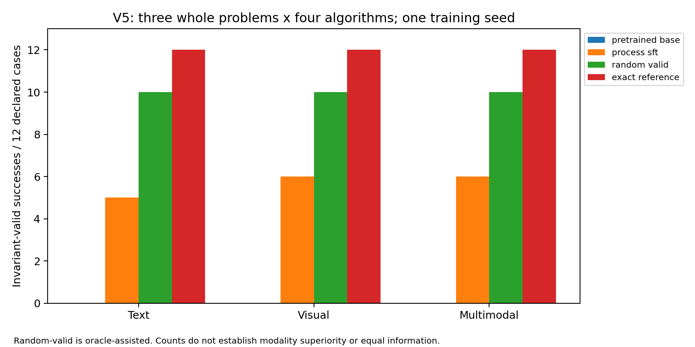

# Matched v5 analysis — #97 and #109

Reproduce with `source ~/cd_vlaplan`, then `CUDA_VISIBLE_DEVICES='' python scripts/analyze_matched_v5.py`. Add `--check` for independent replay and read-only verification of the JSON, CSVs, report and claims. No model calls occur.

| Modality / arm | Successes | Episodes without invalid operations | Invalid / decisions | Expansions |
| --- | ---: | ---: | ---: | ---: |
| text-state / pretrained_base | 0/12 | 0/12 | 12/12 | 0 |
| text-state / process_sft | 5/12 | 5/12 | 7/46 | 18 |
| text-state / random_valid | 10/12 | 12/12 | 0/73 | 43 |
| text-state / exact_reference | 12/12 | 12/12 | 0/72 | 43 |
| visual-state / pretrained_base | 0/12 | 0/12 | 12/12 | 0 |
| visual-state / process_sft | 6/12 | 6/12 | 6/51 | 23 |
| visual-state / random_valid | 10/12 | 12/12 | 0/73 | 43 |
| visual-state / exact_reference | 12/12 | 12/12 | 0/72 | 43 |
| multimodal-state / pretrained_base | 0/12 | 0/12 | 12/12 | 0 |
| multimodal-state / process_sft | 6/12 | 6/12 | 6/52 | 22 |
| multimodal-state / random_valid | 10/12 | 12/12 | 0/73 | 43 |
| multimodal-state / exact_reference | 12/12 | 12/12 | 0/72 | 43 |

**coverage:** All 144 available episodes were independently replayed; 0 declared bindings are missing and 0 evaluation infrastructure stops are recorded. Evidence: `analysis.json: coverage, infrastructure_stops; source episode paths are in each row`.

**validity:** SFT has 19 invalid operations across 36 episodes. On this panel, every unsuccessful SFT episode terminates on an invalid operation; this does not identify what a corrected policy would do afterward. Evidence: `episodes.csv: arm=process_sft, invalid_operations and termination; rejections.csv`.

**prefix:** The reference-derived common caps are Storage 12, Blocksworld 6 and Ferry 8 decisions. 0 observed traces extend beyond these caps, so all observed terminal outcomes remain unchanged here. Evidence: `common-prefixes.csv: common_cap, observed_decisions, censored_at_common_cap`.

**curriculum:** The separate #67 development experiment reports staged, shuffled and mixed-order success of 60/60 each, with zero invalid operations. Random-valid and exact controls also reach 100%; the three paired curriculum success intervals are [0,0]. Evidence: `data/best_first_paired_phase_v3/issue67-terminal/result.json: condition_results, curriculum_conclusion, training, coverage`.

**cost:** Cumulative recorded evaluation stage wall time is 1221.82 seconds. Episode/call timings and token counts are measured separately; early invalid termination reduces consumed work and is not search efficiency. Evidence: `analysis.json: cumulative_stage_seconds; episodes.csv; outputs/matched_modalities/v2/budget.json`.

Operation validity and search quality are distinct. Random-valid is an oracle-assisted programmatic valid-operation control, while SFT must emit the operation schema and search bookkeeping itself. Both receive candidate/Search Memory information; the comparison does not isolate intrinsic planning ability. Conditional success among validity-surviving episodes is selected, not the counterfactual success of a repaired model.

Runtime invariant flags differ by family: BFWS reports maintained runtime invariants even on rejected operations. `runtime_reported_invariants_hold` is preserved; `all_operations_valid` is the uniform zero-invalid-charge measure. Rejected attempts never imply that an invalid physical transition was executed.

`rejections.csv` preserves verbatim replay rejection messages. Categories are descriptive message classifications. BFS sometimes retains only a generic validity rejection; such rows remain unresolved rather than being invented as applicability/effect failures. Absence of an explicit category is not proof that its underlying error could not occur.

`episodes.csv` includes observed search costs and successful solution lengths in unit actions recovered from trusted controller g-values or transition provenance. Failed episodes have no solution cost. `control-gaps.csv` reports each SFT/control paired difference; solution-cost differences use only joint successes, with that selection explicit.

`common-prefixes.csv` is descriptive prefix accounting under the original model-visible budgets, not a rerun with different prompts or a prediction of unobserved continuations. Primary caps remain twice matching exact decisions and matching exact expansions; no new model budget is used.

The analysis unit is the whole problem: only three held-out problems and one training seed. `analysis.json` contains all per-algorithm, per-arm pairwise modality contrasts for success, validity, decisions and expansions. Intervals use 10,000 paired whole-problem bootstrap samples, seed 1729, 95% percentile bounds. The same problem-index samples preserve blocks across comparisons. These tiny-panel intervals do not establish broad superiority, training-seed variance or independent decision-level replication.

V5 matches training exposure, not lossless information. Initial/current images are unlabelled 128px PNGs, resized to 256px by the processor; identities can disappear, as in numbered puzzle tiles. Static-context/goal pages and shared candidate/Search Memory information still contain text. This is not a purely image-only interface.

The #67 result is separate: 12 cost-qualified development tasks, five rollout seeds per trained curriculum adapter, one training seed per cell, 522 updates and two epochs. Its frozen +/-0.05 practical-equivalence finding is limited by complete control saturation. It is not a matched text baseline or a curriculum-by-modality interaction. Historical #75/#76 schedules remain separate and are not pooled. The original h-max/landmark representation question remains unperformed; #67's replacement compares order within additive best-first.

PDF export: [success-counts.pdf](success-counts.pdf). Figure bars are counts over algorithm/problem cases, not independent samples. Numerical support is in summary.csv; all coverage and source links are in coverage.csv.
